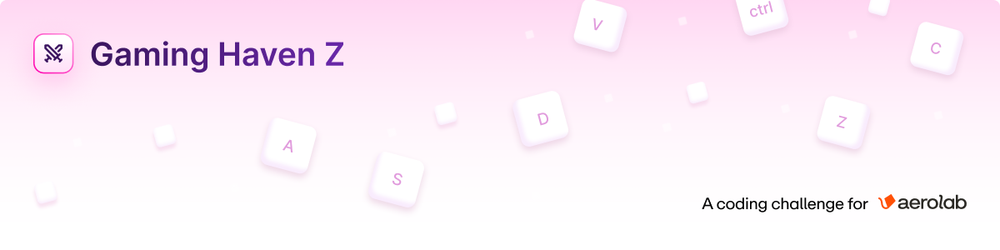

Gaming Haven Z is modern, responsive web application for discovering and collecting your favorite video games. Built for the Aerolab Frontend Challenge with Next.js 15 and powered by the IGDB API.

**🚀 [Live Demo](https://aerolab-challenge-beta-ten.vercel.app/)**

> [!NOTE]
> This project was built following the [Figma design specifications](https://www.figma.com/design/3O7BxHFnSSawJeny3lXWkE/Aerolab-Frontend-Developer-Coding-Challenge---Public?node-id=16996-5165&t=uLiMR18T28Jegm4s-4) with mobile-first responsive design.

## 🚀 Features

### Core Functionality

- **🔍 Real-time Game Search**: Dynamic search with instant results from IGDB API
- **📱 Responsive Design**: Optimized for desktop, tablet, and mobile devices
- **💾 Game Collection**: Add and remove games from your personal collection
- **🎯 Smart Filtering**: Sort games by newest, oldest, or last added
- **📄 Detailed Game Pages**: Comprehensive game information with screenshots and similar games

### Advanced Features

- **🎨 Modern UI**: Gradient backgrounds, animated keys, and smooth transitions
- **✨ Animations**: Custom CSS keyframe animations for page loads and transitions
- **🍞 Toast Notifications**: Custom notifications for collection actions
- **📊 State Management**: Zustand-powered global state with persistence
- **⚡ Performance Optimized**: Image optimization, caching, and efficient API handling
- **🔧 SEO Ready**: Complete metadata, OpenGraph, and PWA support

## 🛠️ Technical Stack

**Built on**: [Aerolab's Next.js Starter](https://github.com/Aerolab/next-starter)

- **Framework**: Next.js 15 (App Router)
- **Language**: TypeScript
- **Styling**: Tailwind CSS with custom animations
- **State Management**: Zustand with persistence
- **API**: IGDB (Internet Game Database)
- **Notifications**: React Hot Toast
- **Icons**: Lucide React
- **Image Handling**: Next.js Image Optimization
- **Deployment**: Vercel

## 📋 Challenge Requirements Fulfilled

### ✅ Core Requirements

- [x] **Home Page**: Searchable game collection with grid layout and sorting
- [x] **Search Functionality**: Real-time search with 5-10 results display
- [x] **Game Detail Pages**: Complete game information with screenshots
- [x] **Collection Management**: Add/remove games with persistent storage
- [x] **Responsive Design**: Mobile-first approach with desktop enhancements
- [x] **Empty States**: Elegant handling of empty collection

### ✅ Technical Requirements

- [x] **Next.js App Router**: Latest Next.js 15 with app directory
- [x] **TypeScript**: Full type safety throughout the application
- [x] **Tailwind CSS**: Utility-first styling with custom components
- [x] **IGDB API Integration**: Efficient data fetching and caching
- [x] **State Management**: Zustand for predictable state updates
- [x] **Performance**: Optimized images, lazy loading, and efficient rendering

### ✅ Extra Considerations

- [x] **SEO Optimization**: Complete metadata, favicons, and PWA manifest
- [x] **Visual Animations**: Custom CSS animations and smooth transitions
- [x] **Error Handling**: Graceful error states and user feedback
- [x] **Code Documentation**: Clean, documented, and maintainable code

## 🎨 Key Features Deep Dive

### Animation System

- **Page Load Animations**: Logo and background elements fade in with staggered timing
- **Header Transitions**: Smooth logo/back button transitions between pages
- **Background Elements**: Animated keys and gradient that move on game detail pages
- **Toast Notifications**: Custom-styled notifications with icons and smooth animations

### State Management

- **Zustand Store**: Centralized state for games, favorites, and UI state
- **Persistence**: Local storage integration for collection persistence

### Performance Optimizations

- **API Caching**: Intelligent caching of game data and search results
- **Image Optimization**: Next.js Image component with lazy loading
- **Component Optimization**: Efficient re-renders and state updates

## 🚀 Getting Started

> [!IMPORTANT]
> You'll need IGDB API credentials to run this project. See the [IGDB API Setup](#igdb-api-setup) section below.

### Prerequisites

- Node.js 18+
- PNPM (recommended) or npm
- IGDB API credentials

### Installation

1. **Clone the repository**

   ```bash
   git clone https://github.com/hbaravalle/aerolab-challenge.git
   cd aerolab-challenge
   ```

2. **Install dependencies**

   ```bash
   pnpm install
   ```

3. **Set up environment variables**

   ```bash
   cp .env.example .env.local
   ```

   Add your IGDB API credentials:

   ```env
   IGDB_CLIENT_ID=your_client_id
   IGDB_ACCESS_TOKEN=your_access_token
   SITE_URL=http://localhost:3000
   ```

4. **Run the development server**

   ```bash
   pnpm dev
   ```

5. **Open your browser**
   Navigate to [http://localhost:3000](http://localhost:3000)

### IGDB API Setup

1. Register at [IGDB](https://api.igdb.com/)
2. Create a Twitch application
3. Get your Client ID and Access Token
4. Add credentials to your environment variables

## 📁 Project Structure

```
src/
├── app/                 # Next.js App Router
│   ├── game/[slug]/    # Dynamic game detail pages
│   ├── globals.css     # Global styles and animations
│   └── layout.tsx      # Root layout with metadata
├── components/
│   ├── common/         # Reusable UI components
│   └── ui/             # Base UI components
├── lib/               # Utilities and configurations
├── types/             # TypeScript type definitions
└── utils/             # Helper functions
```

## 🚢 Deployment

The application is optimized for Vercel deployment with:

- Automatic deployments from main branch
- Environment variables configured

## 📝 Development Process

This project was built following modern development practices:

- **Git Workflow**: Feature branches with descriptive commit messages
- **Code Quality**: ESLint, Prettier, and TypeScript for code consistency
- **Documentation**: Comprehensive code documentation and README

## 👤 About the Challenger

Hi! I'm Hernán — sticker lover, Full-Stack Developer and UX Engineer with +10 years of experience, based in Buenos Aires, Argentina. EdTech specialist at Digital House LATAM, Hack Academy, and TripleTen.

I really enjoyed working on this challenge and hope it meets your expectations! It was a great opportunity to showcase my skills while learning and implementing new features.

---

_Built with lot of love ❤️ for the Aerolab Team 🪁._
